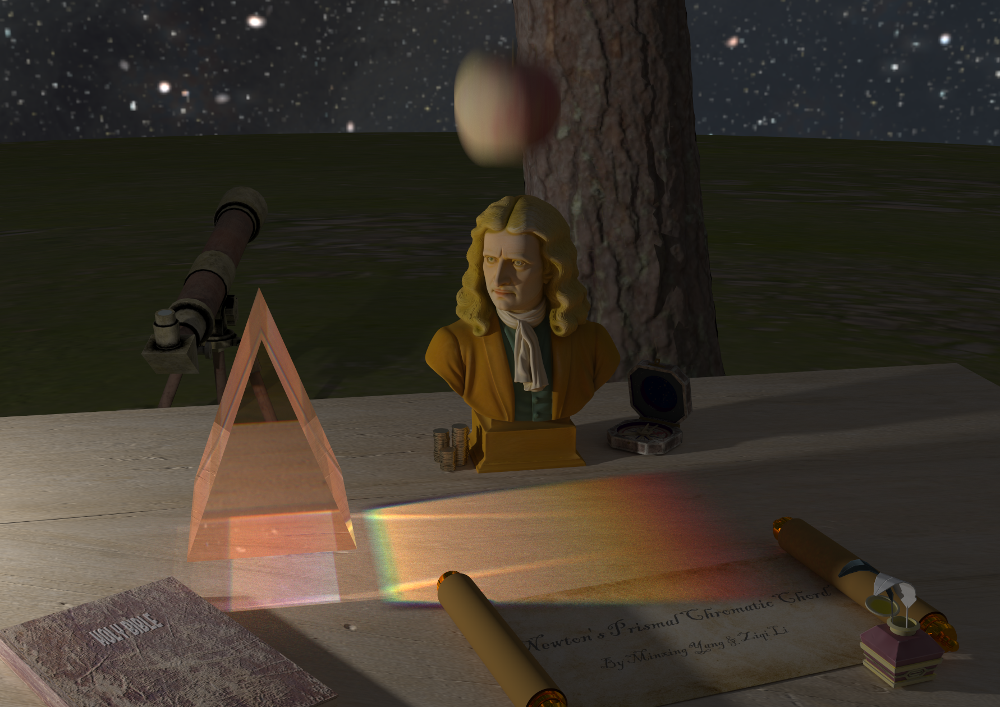
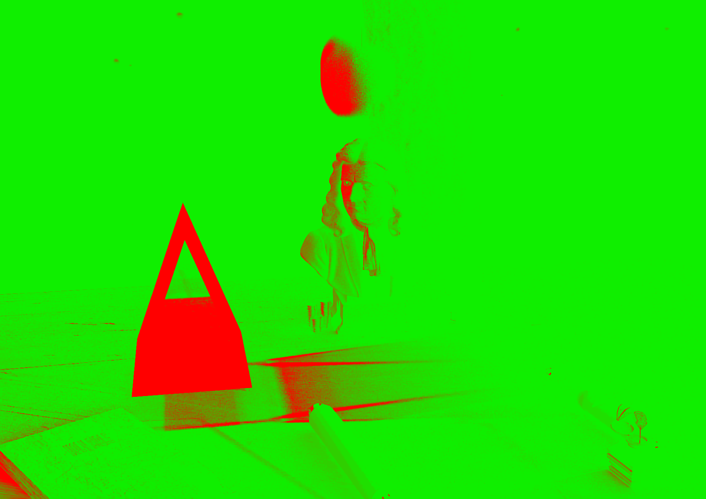

### Newton's Prismal Chromatic Chord

本项目是清华大学 2025 年秋季学期《高等计算机图形学》渲染赛道的课程项目，作者是杨敏行和李子祺。

本项目从头搭建了一个功能完善且强大的渲染器，核心亮点包括：

- 支持基于 **光线追踪** (Path Tracing) 和 **光子映射** (Photon Mapping) 两种模式的渲染器。

- 支持色散等高级视觉效果。

- 以及其它如动态模糊、景深、环境和法线贴图等基础功能。

项目的主视觉图如下：



项目的代码架构如下：

```
MyPathTracer/
├── CMakeLists.txt                // 构建系统配置
├── external/                     // 第三方依赖库
│   ├── stb_image.h               // 图像加载 (stb库)
│   ├── stb_image_write.h         // 图像输出/保存 (stb库)
│   └── tiny_obj_loader.h         // .obj 模型文件加载
└── src/
    ├── accel/                    // 空间加速结构
    │   ├── AABB.hpp              // 轴对齐包围盒 (Axis-Aligned Bounding Box)
    │   ├── BVH.hpp               // 层次包围盒 (Bounding Volume Hierarchy，场景/网格加速)
    │   └── kdtree.hpp            // KD-Tree (专门用于光子映射的最近邻搜索)
    ├── core/                     // 核心数据结构与工具
    │   ├── distribution.hpp      // 概率分布工具 (PDF封装，用于重要性采样/环境光采样)
    │   ├── loader_impl.cpp       // 第三方库(stb/tiny_obj)的实现宏定义
    │   ├── onb.hpp               // 正交基 (Orthonormal Basis，用于切线空间变换)
    │   ├── photon.hpp            // 光子结构体 (用于光子映射)
    │   ├── ray.hpp               // 光线类 (包含原点、方向、时间t和可选的波长信息)
    │   ├── record.hpp            // 记录结构体 (HitRecord: 击中点信息; ScatterRecord: 散射信息)
    │   └── utils.hpp             // 通用工具 (数学常量、随机数生成器、颜色转换)
    ├── light/                    // 光源系统
    │   ├── arealight.hpp         // 面光源 (基于几何体的发光，包装 Object)
    │   ├── envirlight.hpp        // 环境光 (基于无限远处的 HDR 贴图照明)
    │   ├── light_agg.hpp         // 光源头文件聚合 (方便包含)
    │   ├── light_utils.hpp       // Light 基类 (定义光源接口)
    │   └── pointlight.hpp        // 点光源 (无几何形状的理想光源)
    ├── material/                 // 材质系统
    │   ├── diffuse.hpp           // 漫反射材质 (Lambertian，支持法线贴图)
    │   ├── dispersive.hpp        // 色散材质 (模拟棱镜分光/色差效果，基于波长的折射)
    │   ├── emitter.hpp           // 自发光材质 (DiffuseLight，用于面光源)
    │   ├── glass.hpp             // 绝缘体材质 (Dielectric，玻璃/水，含反射与折射)
    │   ├── material_agg.hpp      // 材质头文件聚合
    │   ├── material_utils.hpp    // Material 基类 (定义散射行为)
    │   ├── metal.hpp             // 金属材质 (支持模糊反射)
    │   └── phase_function.hpp    // 相函数 (Isotropic，用于参与介质/体积渲染)
    ├── object/                   // 几何对象
    │   ├── mesh.hpp              // 三角网格 (加载 .obj 模型，内部包含子 BVH)
    │   ├── moving_sphere.hpp     // 运动球体 (支持运动模糊)
    │   ├── object_agg.hpp        // 几何对象头文件聚合
    │   ├── object_utils.hpp      // Object/Hittable 基类 (定义求交接口)
    │   ├── sphere.hpp            // 标准球体
    │   ├── triangle.hpp          // 单个三角形 (支持 Phong 平滑着色/重心坐标插值)
    │   └── volume.hpp            // 恒定介质 (ConstantMedium，体积渲染/烟雾/雾)
    ├── renderer/                 // 渲染积分器
    │   ├── integrator_utils.hpp  // 积分器基类与工具 (含 NEE: 下一事件估计逻辑)
    │   ├── path_integrator.hpp   // 路径追踪积分器 (Path Tracing, 含 MIS 和俄罗斯轮盘赌)
    │   └── photon_integrator.hpp // 光子映射积分器 (SPPM/PPM, 处理焦散 Caustics)
    ├── scene/                    // 场景描述
    │   ├── camera.hpp            // 相机类 (支持景深 DoF、视场角 FOV、快门时间)
    │   └── scene.hpp             // 场景容器 (管理 Object 列表、Light 列表及顶层 BVH)
    ├── texture/                  // 纹理系统
    │   ├── checker.hpp           // 棋盘格纹理 (程序化生成)
    │   ├── image_texture.hpp     // 图片纹理 (映射 UV，支持双线性插值)
    │   ├── perlin.hpp            // 柏林噪声纹理 (大理石/湍流效果)
    │   ├── solid_color.hpp       // 纯色纹理
    │   ├── texture_agg.hpp       // 纹理头文件聚合
    │   └── texture_utils.hpp     // Texture 基类 (定义颜色采样接口)
    ├── main.cpp                  // 程序入口 (配置参数、初始化渲染器、主渲染循环)
    └── scene_list.cpp            // 场景预设 (硬编码的测试场景定义)
```

运行方法：

在主目录下新建 `build` 文件夹后，在其中调用命令 `cmake --build .`，即可生成 `bin/MyPathTracer.exe`，直接运行即可开始渲染。推荐启用 `Release` 模式，否则渲染会非常慢。

项目会按照 `scene_[num]_[PT/PM]_[heatmap/output]_samples_[SPP].png` 命名格式保存 snapshot 文件，保存的快照 SPP 依次翻倍。项目使用了 Adaptive Sampling 技术，会跳过收敛的像素，因此越往后的 batch 会进行的越快。

项目会保存 Heat Map，可以反映出像素的收敛速度，如下图：

<p align="center">
  
  
  
  
</p>